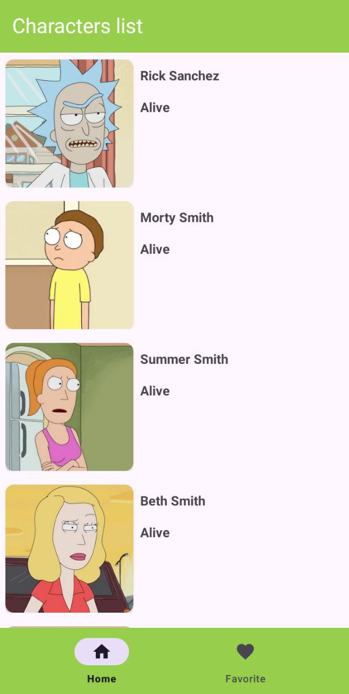
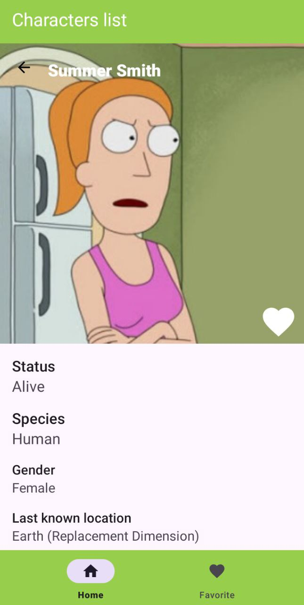
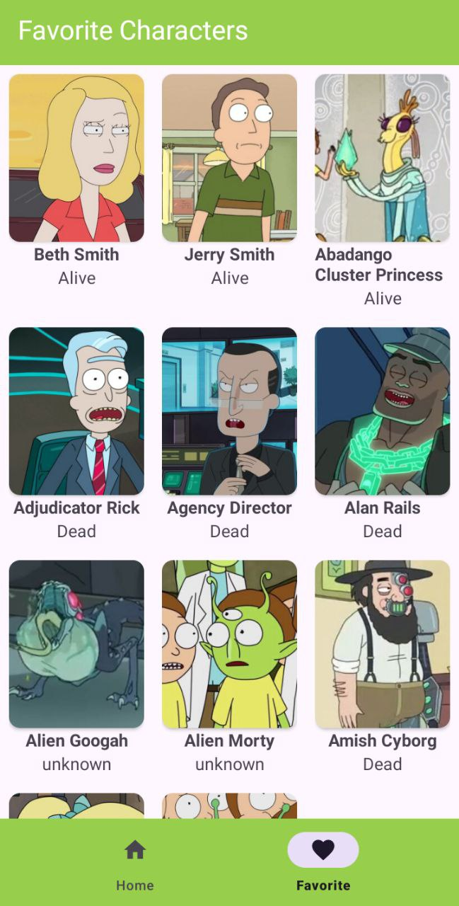

# RICK AND MORTY CHARACTER APP

This is a simple android application that fetches and displays characters from the popular TV show "Rick and Morty" using the [Rick and Morty API](https://rickandmortyapi.com/).

## screenshots

-|-|-
||

## Features
- *Character List* : Displays a list of characters from the show.
- *Character Details* : View detailed information about each character such as name, species, status, and origin.
- *Favorite Character* : Display a list of the user's favorite characters.

## Architecture

The application utilizes MVVM (Model-View-ViewModel) architecture.

## Libraries

The app uses the following libraries:
- **Kotlin** : The main language for Android development.
- **Coroutines**: For asynchronous programming, ensuring smooth user experiences when fetching data from the API.
- **Retrofit** : For making API requests to the Rick and Morty API.
- **Hilt**: For Dependency Injection, promoting better testability and clean architecture.
- **Room**: For local data storage, allowing users to save their favorite characters offline.

